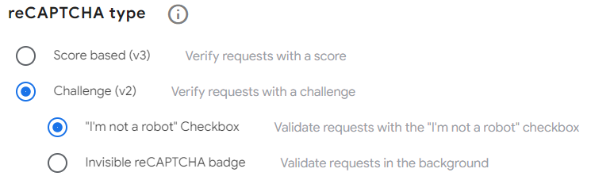

# USER SIGNUP SIGNIN
### IMPORTANT
I am not the first author of this repo. Me and my team added a google reCAPTCHA and a new UI and multiple security improvements. You can visit the author's repo by using this link
[init0x1/Auth-Flow](https://github.com/init0x1/Auth-Flow)
---
This project is a simple user authentication system that uses Express.js and MongoDB to store user data. The system allows users to sign up and log in, and it also includes session management and rate limiting to prevent brute-force attacks.

## Dependencies
This project uses several dependencies, including:

- `express`: A web framework for Node.js
- `mongoose`: A MongoDB ORM library
- `body-parser`: Middleware for parsing HTTP request bodies
- `cookie-parser`: Middleware for parsing HTTP cookies
- `express-session`: Middleware for managing sessions
- `express-rate-limit`: Middleware for rate limiting HTTP requests
- `morgan`: Middleware for logging HTTP requests
- `dotenv`
- `axios`
- `crypto`
- `querystring`

## Getting Started

To get started with this project, follow these steps:

1) Clone the repository and navigate to the project directory:
```bash
git clone https://github.com/Anuradha2k21/Sign-in_and_Sign-up
```

2) Install the dependencies using npm:
```bash
npm install
```
3) create a `.env` file in the root directory and create two variables named `MONGOOSE_CON_STRING` and `CAPTCHA_SECRET` give values as followings
    - `MONGOOSE_CON_STRING` - connection string of the mongodb database (either local or mongodb atlas)
    - `CAPTCHA_SECRET` - google reCAPTCHA **SECRET KEY** (when creating a new google reCAPTCHA, add a *domain* as `localhost` if you are running on a local machine. Give reCAPTCHA type as *Challenge (v2)/
"I'm not a robot" Checkbox* and fill other fields with appropriate details. picture shown below)
    
    Go to this link to create a new Google reCAPTCHA → [link](https://www.google.com/recaptcha/about/)
4) go to **/public/index.html and /public/signup.html** and assign *data-sitekey=""*  *(at line 60)* to the **SITE KEY** from the created *reCAPTCHA* key.
4) Start the server:
```bash
npm start
```
5) Open a web browser and navigate to `http://localhost:3000`


## Usage
The user authentication system includes several endpoints for signing up, logging in, and logging out. Here is an overview of each endpoint:

- `GET /`: Redirects to either the login page or the home page, depending on whether the user is logged in.
- `GET /login`: Renders the login page.
- `POST /login`: Logs in the user and redirects to the home page.
- `POST /logout`: Logs out the user and redirects to the login page.
- `GET /home`: Renders the home page.
- `GET /signup`: Renders the signup page.
- `POST /signup`: Signs up the user and redirects to the login page.
The system also includes session management to keep users logged in across requests. If a user is not logged in and attempts to access the home page or log out, they will be redirected to the login page.

## Security
To improve the security of the user authentication system, several measures have been implemented:

Session management using `express-session`.
HTTP cookies with the `httpOnly` and `secure` flags.
Rate limiting using `express-rate-limit`.
And many more.

## Collaborators

- [Adithya](https://github.com/adithya-yashodhi?query=anuradhasanjaya2024%40gmail.com)
- [Umandi](https://github.com/ThisaruUmandi)
- [Hansani](https://github.com/Samudi1234)